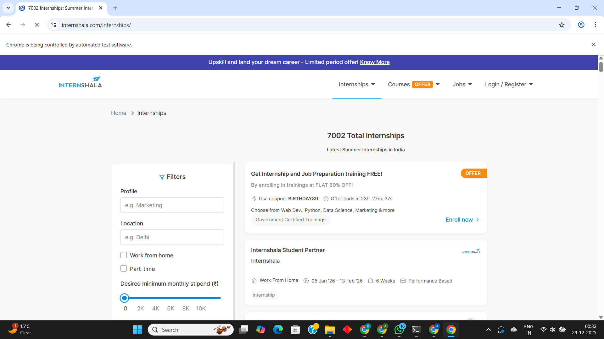
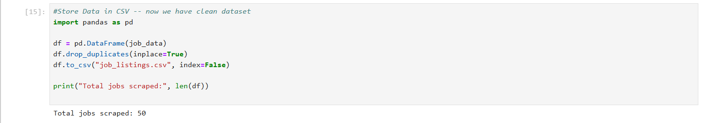
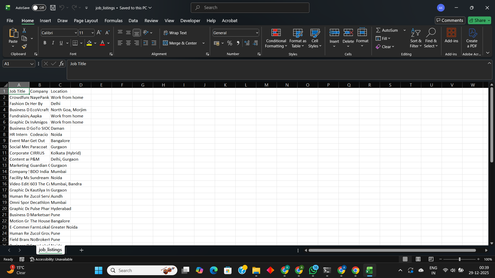

# Job Listings Web Scraper (Python)

## Overview
A Python-based web scraping project that collects job listings from dynamic job portals using Selenium. 
The scraper extracts structured job data, cleans it, and stores it in CSV format for analysis.

## Features
- Scrapes dynamic, JavaScript-rendered websites
- Handles pagination to collect 500+ job listings
- Cleans and structures job data
- Saves output in CSV format
- Captures screenshots for monitoring and debugging

## Tech Stack
- Python
- Selenium
- Pandas
- WebDriver Manager

## Demo
1. Run the scraper script
2. Selenium opens the job portal automatically
3. Job listings are extracted page by page
4. Final dataset is saved as a CSV file

## Screenshots

### Browser Automation

### Script Output

### CSV Output

## Output
- job_listings.csv
- 50+ structured job records

## Folder Structure
Job-Listings-Web-Scraper/

│

├── scraper.py

├── job_listings.csv

├── README.md

├── screenshots/

│   ├── browser_open.png

│   ├── script_output.png

│   └── csv_output.png

